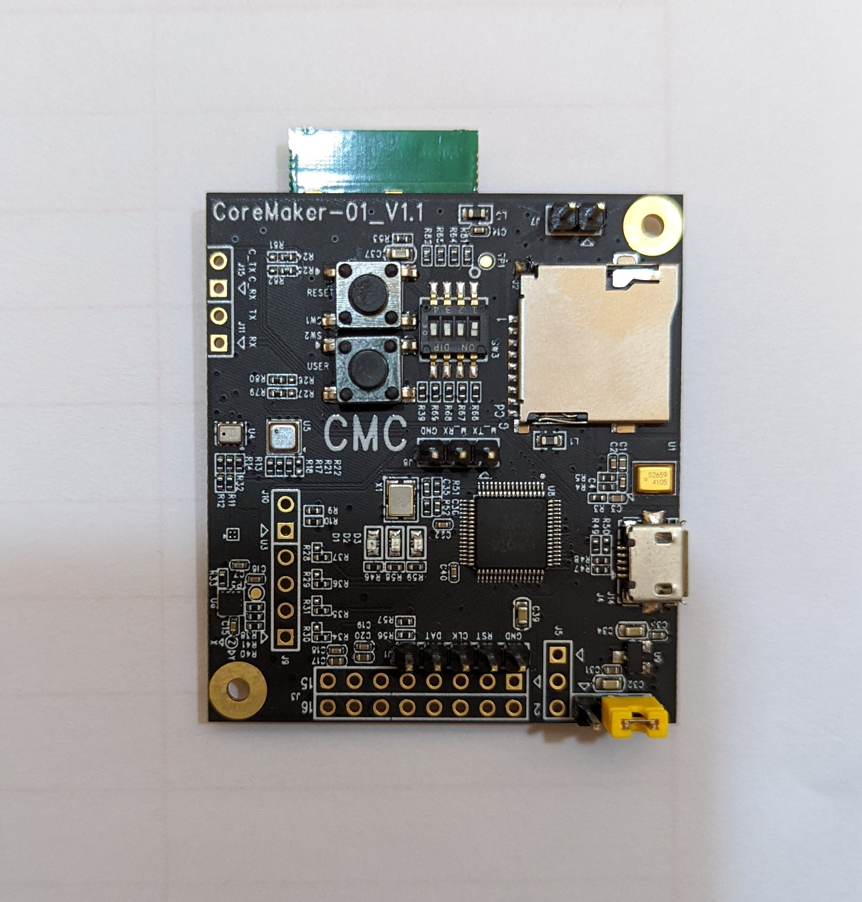
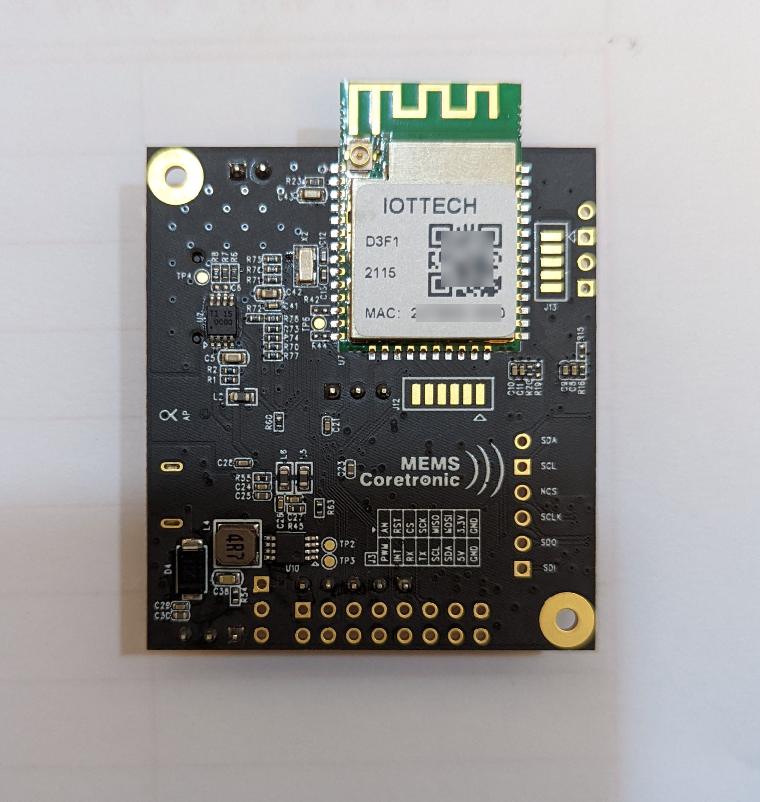

# CMC-CoreMaker01-Samples

## SDCardWriteReadTxt  

### 此範例程式的功能為:  
燒錄完成後 CMC-CoreMaker01 執行寫入檔名為 test.txt 文字檔到 SD 卡並且完成從 SD 卡中的 test.txt 檔案讀取資料。前述動作若執行成功則晶片版上的 LED 綠燈會開始閃爍；失敗則晶片版上的 LED 藍燈會開始閃爍。  

資料夾內部為完整 CMC-CoreMaker01 的範例程式可直接編譯此資料夾內含的檔案並且進行燒錄。
